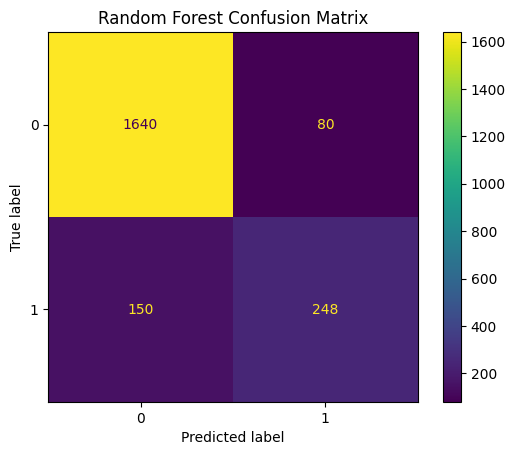
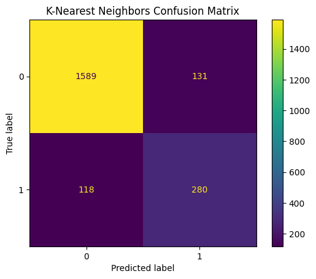
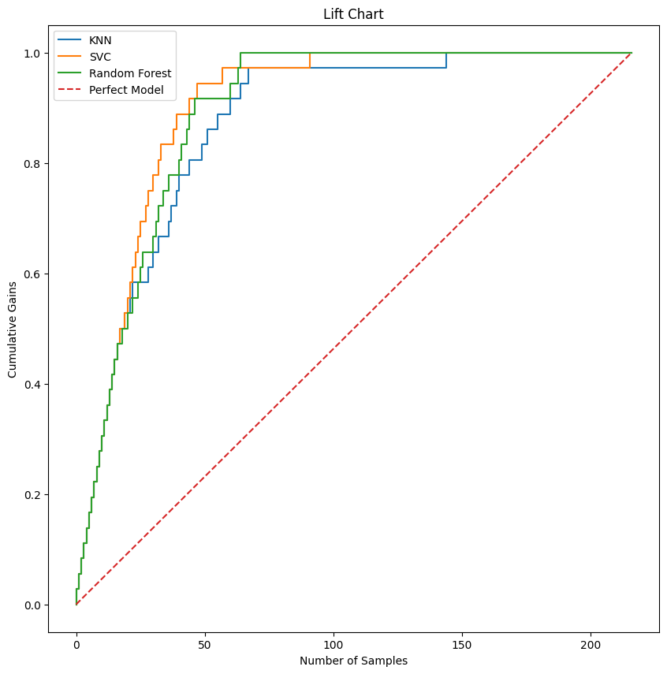

# Formula 1 Grand Prix Podium Winners Prediction

## NON-TECHNICAL EXPLANATION OF YOUR PROJECT

This project is about using public domain data to predict race results for Formula 1 grands prix. More specifically, it uses data from 1983 onwards to predict the podium winners. The model is trained on a variety of features such as the driver's performance and the team's performance, incorporating both historical performance as well as performance through the season to date.

## DATA

The data used for developing the model is from the Ergast API, which is a free-to-use API that provides Formula 1 data. The data is used to create a dataset that includes information about the drivers, teams, and circuits, as well as the results of each race.

## MODEL

This project uses a K-Nearest Neighbours, Support Vector Machine, and Random Forest model to predict the podium winners. These models were chosen because they are well suited to classification tasks, and they do not require a lot of tuning or a very large dataset to get good results.

## HYPERPARAMETER OPTIMSATION

For each model, the hyperparameters were optimised using a grid search. Due to the imbalance of non-podium finishes compared to podium finishes, the F1 scoring metric was used, which is the harmonic mean of precision and recall. This metric is well suited to imbalanced datasets, as it gives equal weight to false positives and false negatives.

The hyperparameters that were optimised are as follows:

K-Nearest Neighbours:

- n_neighbors: 11
- weights: uniform

Support Vector Machine:

- C: 0.01
- kernel: linear
- gamma: 1

Random Forest:

- n_estimators: 200
- criterion: gini
- max_depth: 2
- max_features: None

## RESULTS

A summary of your results and what you can learn from your model.

The models were evaluated using the F1 score, precision, recall, and confusion matrix.

The Support Vector Machine model performed the best, with an F1 score of 0.90, precision of 0.90, and recall of 0.90.

The Random Forest model performed the worst, with an F1 score of 0.88, precision of 0.88, and recall of 0.89.

The K-Nearest Neighbours model performed in between, with an F1 score of 0.89, precision of 0.89, and recall of 0.89.

In summary, all models performed well, and as the following lift chart shows, the Support Vector Machine model is the best performing model.

The Random Forest model is the worst performing model, but it still performs well due to the importance of the features used in the model. The cumulative driver percentage of podiums has a very high degree of predictive power, presumably due to the fact that the best drivers with the fastest cars are more likely to finish on the podium.

A future improvement to the model could be to include more features, such as the weather conditions, the track layout, and the tyre compounds used, as these are all factors that can affect the outcome.
